# PoliwhiRL Architecture Documentation

## Overview

PoliwhiRL is a sophisticated reinforcement learning library designed specifically for training AI agents to play sprite-based 2D Pokémon games. The system leverages PyBoy emulator integration and implements advanced RL techniques including Transformer-based models, intrinsic curiosity, macro action learning, and multi-agent training.

## System Architecture

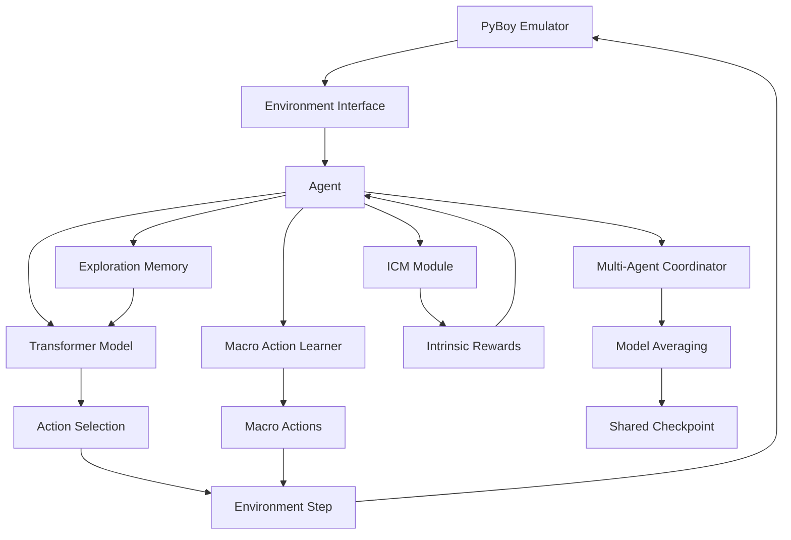

## Core Components

### 1. Model Architectures

#### PPO Transformer Architecture

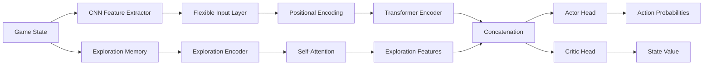

**Key Features:**
- **FlexibleInputLayer**: Handles both CNN (image) and direct state inputs
- **ExplorationEncoder**: Processes visit history using self-attention
- **Transformer Core**: Sequential state processing with positional encoding
- **Dual Outputs**: Actor (policy) and Critic (value estimation)

#### ICM (Intrinsic Curiosity Module)

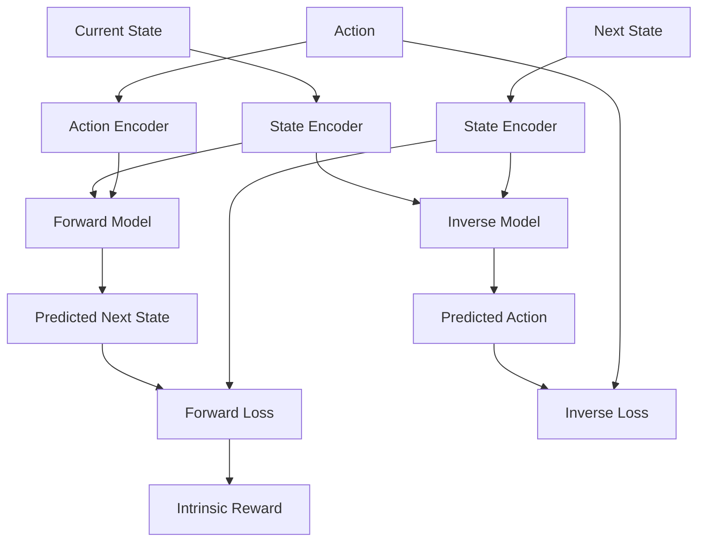

**Purpose**: Provides curiosity-driven exploration by rewarding agents for visiting novel states.

### 2. Macro Action Learning System

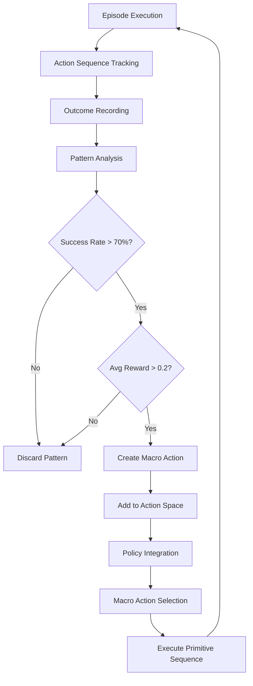

**How it Works:**
1. **Discovery Phase**: Tracks action sequences during episodes
2. **Evaluation Phase**: Assesses sequences based on success rate and reward
3. **Integration Phase**: Successful patterns become available as macro actions
4. **Execution Phase**: When selected, macro actions execute their underlying primitive sequence

**Key Benefits:**
- Automatic discovery of useful behavioral patterns
- Hierarchical action space (primitives + discovered macros)
- Temporal abstraction for complex tasks

### 3. Multi-Agent Training System

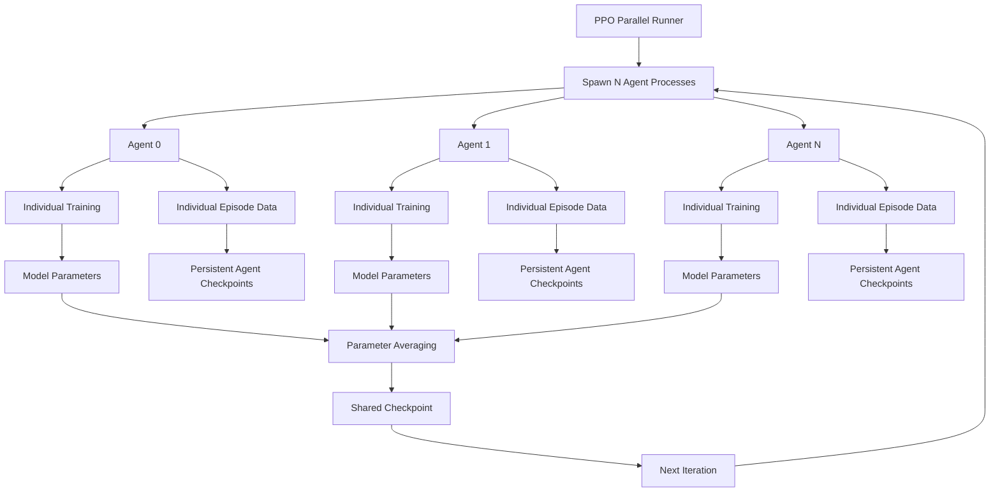

**Key Features:**
- **Process Isolation**: Each agent runs in separate process for robustness
- **Model Averaging**: Parameters averaged across all successful agents
- **Data Persistence**: Individual agents maintain their own episode history
- **Fault Tolerance**: Training continues even if some agents fail

### 4. Curriculum Learning Pipeline

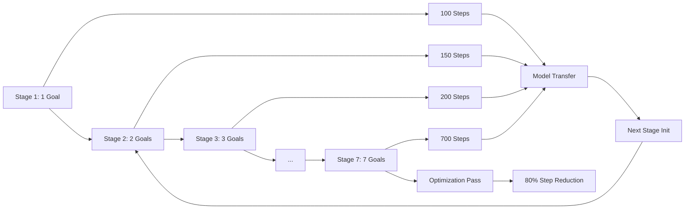

**Progressive Difficulty:**
- **Goal Complexity**: 1 → 7 location goals
- **Step Constraints**: Increasingly tight episode length limits
- **Model Transfer**: Each stage inherits previous stage's knowledge
- **Optimization**: Optional refinement pass with stricter constraints

### 5. Exploration and Memory Systems

#### Enhanced Exploration Memory

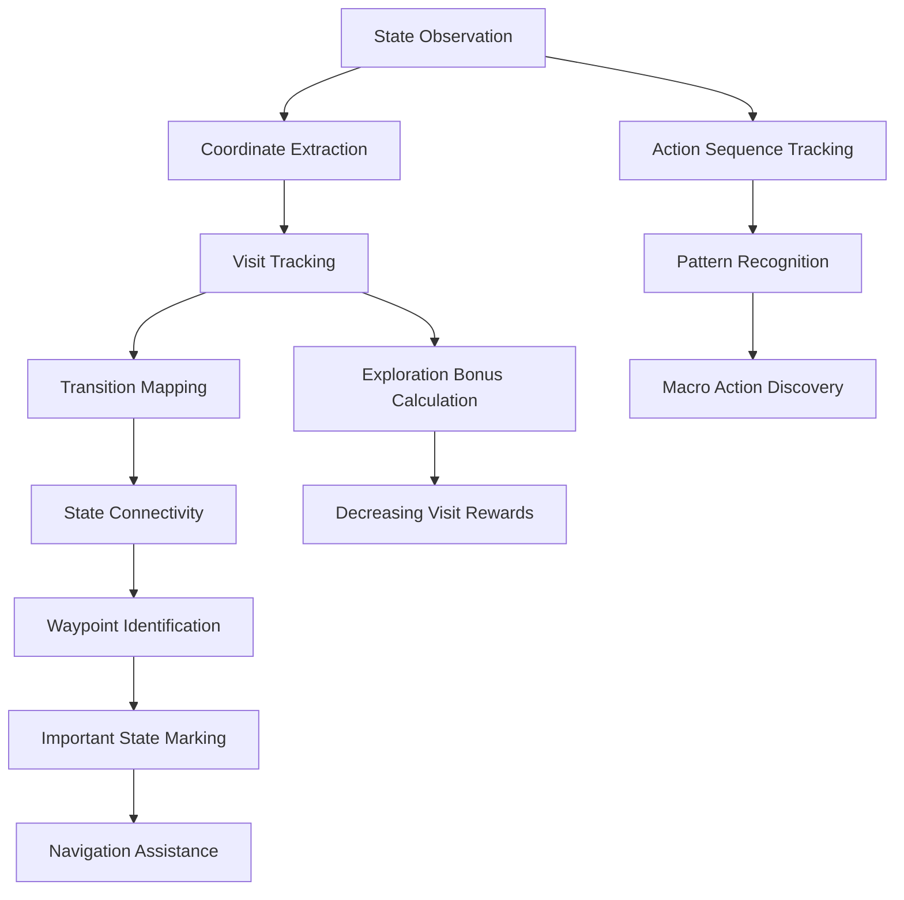

**Capabilities:**
- **State Transition Learning**: Maps reachable states via actions
- **Waypoint Discovery**: Identifies strategically important locations
- **Exploration Bonuses**: Encourages visiting new areas
- **Sequence Learning**: Discovers recurring action patterns

#### Standard Exploration Memory

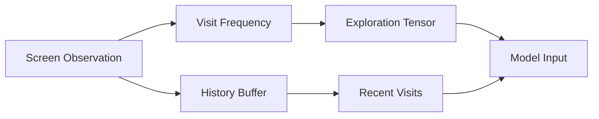

**Simple Tracking**: Basic visit frequency and recency for exploration guidance.

## Data Flow and Training Loop

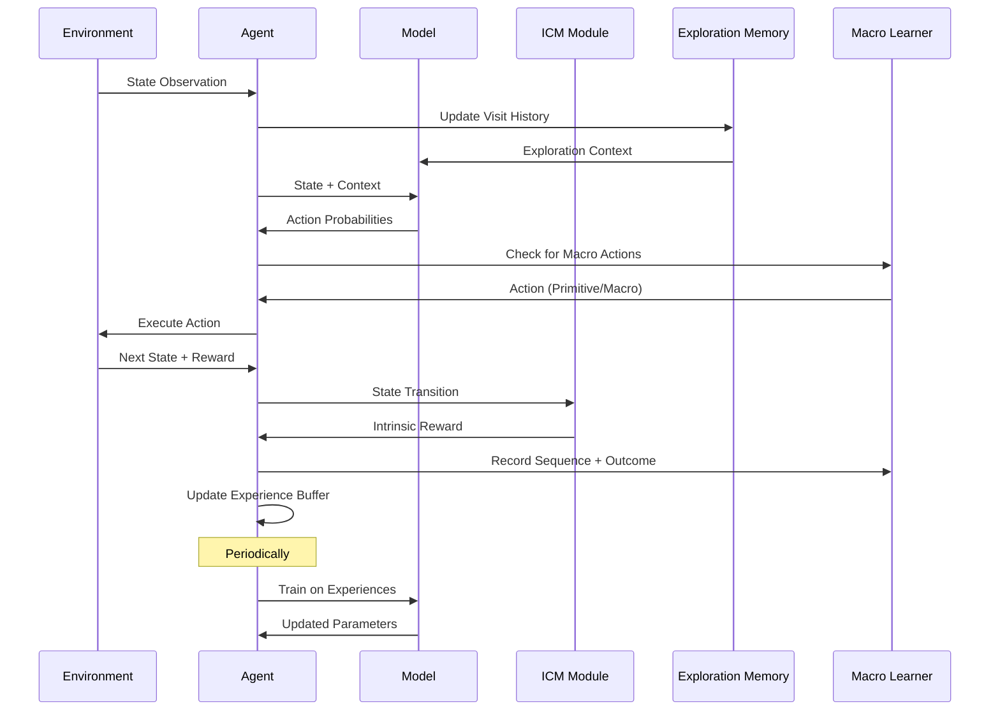

## Reward System Architecture

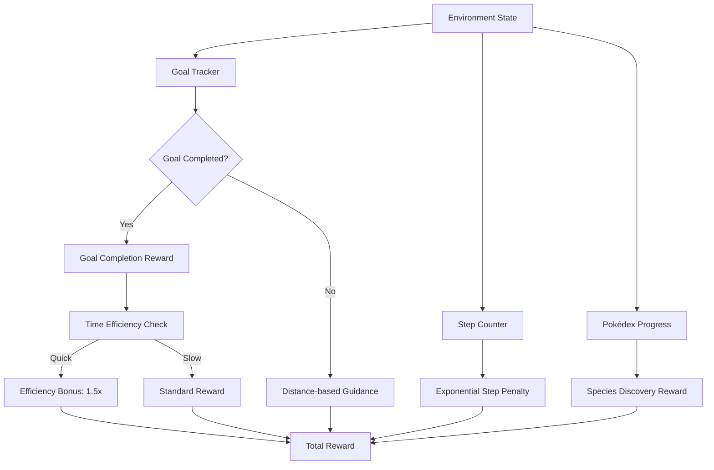

**Reward Components:**
- **Goal Completion**: 1.0-5.0 points (decreasing with time)
- **Efficiency Bonus**: 1.5x multiplier for quick completion
- **Distance Guidance**: Proportional reward for approaching goals
- **Step Penalty**: Exponentially increasing negative reward
- **Exploration**: Pokédex discovery bonuses

## Configuration System

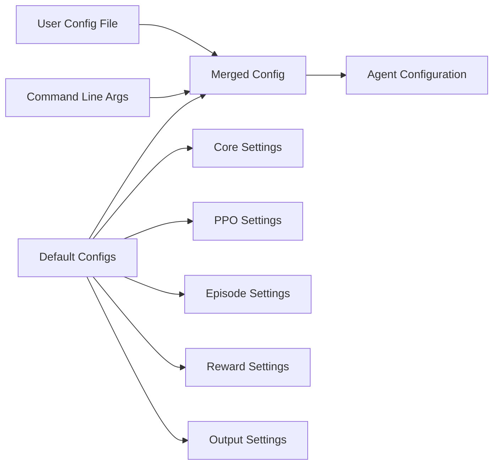

**Priority Order**: Command Line > User Config > Default Config

## File Structure Overview

```
PoliwhiRL/
├── agents/                     # RL Agent Implementations
│   ├── PPO/
│   │   ├── ppo_agent.py       # Core PPO agent
│   │   └── parallel_runner.py # Multi-agent coordinator
│   └── DQN/
│       ├── DQNPokemonAgent.py # Main DQN agent
│       └── multi_agent.py     # DQN parallel execution
├── models/                     # Neural Network Architectures
│   ├── PPO/
│   │   └── PPOTransformer.py  # Transformer-based actor-critic
│   ├── DQN/
│   │   └── DQNTransformer.py  # Transformer-based Q-network
│   └── ICM/
│       └── icm.py             # Intrinsic Curiosity Module
├── environment/                # Game Environment Interface
│   ├── gym_env.py             # PyBoy wrapper
│   └── rewards.py             # Reward calculation logic
├── utils/                      # Utility Systems
│   ├── macro_actions.py       # Macro action learning
│   └── resource_manager.py    # Multi-process coordination
└── replay/                     # Memory Systems
    ├── enhanced_exploration_memory.py
    └── exploration_memory.py
```

## Key Design Principles

### 1. Modularity
- Clear separation between environment, agent, model, and utility components
- Configurable system with JSON-based settings
- Swappable components (different models, memory systems, etc.)

### 2. Scalability
- Multi-agent training with parameter averaging
- Process-based parallelism for robustness
- Efficient memory management for long episodes

### 3. Exploration Strategy
- Multiple exploration mechanisms working in concert:
  - ICM for curiosity-driven exploration
  - Exploration memory for visit tracking
  - Macro actions for behavioral diversity
  - Curriculum learning for progressive complexity

### 4. Temporal Abstraction
- Macro action learning for hierarchical control
- Transformer models for sequential decision making
- Curriculum learning for staged skill acquisition

## Advanced Features

### Episode Data Persistence
- Each agent maintains individual episode history
- Statistics accumulate across training iterations
- Plotting and analysis preserve full training progression

### Checkpoint Management
- Shared model checkpoints for collective learning
- Individual agent checkpoints for data persistence
- Curriculum stage transfer for progressive training

### Resource Management
- Temporary file coordination across processes
- Memory-efficient exploration tracking
- Robust cleanup procedures

This architecture enables PoliwhiRL to tackle the complex, long-horizon task of playing Pokémon games efficiently through a combination of advanced RL techniques, careful engineering, and domain-specific optimizations.