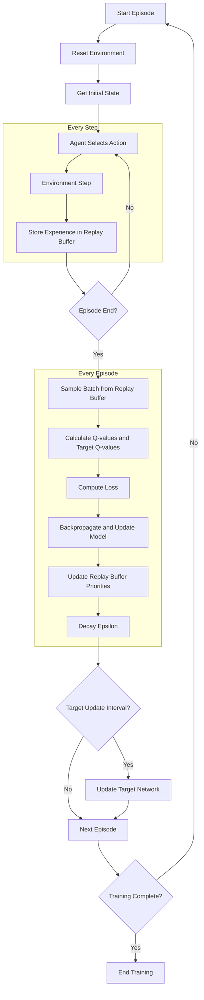
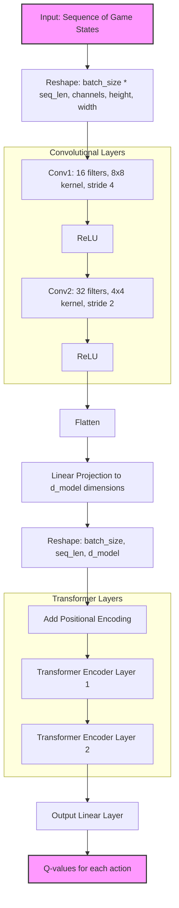

# PoliwhiRL README
<p align="left">
  <a href="https://results.pre-commit.ci/latest/github/AoifeHughes/PoliwhiRL/main">
    
  </a>
  <a href="https://github.com/AoifeHughes/PoliwhiRL/actions/workflows/run_tests.yml">
    
  </a>
</p>


## Legal Disclaimer
This project is not affiliated with, endorsed, or sponsored by Nintendo, Game Freak, or The Pokémon Company. All Pokémon games and characters are trademarks of Nintendo, Game Freak, and The Pokémon Company. This project is intended for educational and research purposes only.

All usage of The Pokemon Company International's games is done with the understanding that software is legally obtained and that the user has the right to use it. This project does not provide any ROMs or copyrighted materials.

## Overview
PoliwhiRL is a Reinforcement Learning library designed for sprite-based 2-D Pokémon games. It provides a framework for experimenting with different RL algorithms to interact with Pokémon games in an emulated environment. The current focus is on a Transformer-based DQN model.

## Configuration

PoliwhiRL uses a modular configuration system that allows for easy customization of various parameters. The configuration is split into several JSON files, each focusing on a specific aspect of the system. Users can override these defaults by providing their own configuration files or using command-line arguments.

### Core Settings

These settings define the basic parameters for the model and environment.

| Variable | Description |
|----------|-------------|
| model | The type of model to use (e.g., "PPO") |
| erase | Whether to erase previous data (true/false) |
| device | The device to run the model on (e.g., "mps", "cuda", "cpu") |
| scaling_factor | Factor to scale down the input images |
| use_grayscale | Whether to convert input images to grayscale |
| vision | Whether to use visual input or not |
| sequence_length | Number of sequential steps to consider |
| record | Whether to record the training process |
| verbose | Whether to print detailed logs |
| manual_control | Whether to allow manual control |
| load_checkpoint | Path to load a checkpoint from |
| load_checkpoint_num | Number of the checkpoint to load |

### ROM Settings

These settings specify the paths to the ROM and related files.

| Variable | Description |
|----------|-------------|
| rom_path | Path to the Pokemon ROM file |
| state_path | Path to the initial game state file |
| extra_files | List of additional files needed for the emulator |

### Reward Settings

These settings define the goals and rewards for the agent.

| Variable | Description |
|----------|-------------|
| location_goals | List of location-based goals for the agent |
| pokedex_goals | Goals related to the Pokedex completion |
| N_goals_target | Number of goals to target |
| break_on_goal | Whether to end the episode upon reaching a goal |
| punish_steps | Whether to apply a penalty for each step taken |

### PPO Settings

These settings are specific to the PPO (Proximal Policy Optimization) algorithm.

| Variable | Description |
|----------|-------------|
| ppo_gamma | Discount factor for future rewards |
| ppo_learning_rate | Learning rate for the PPO algorithm |
| ppo_epochs | Number of epochs to train on each batch of data |
| ppo_update_frequency | How often to update the policy |
| ppo_epsilon | Clipping parameter for PPO |
| ppo_value_loss_coef | Coefficient for the value function loss |
| ppo_entropy_coef | Coefficient for the entropy term |
| ppo_entropy_coef_decay | Decay rate for the entropy coefficient |
| ppo_entropy_coef_min | Minimum value for the entropy coefficient |
| ppo_extrinsic_reward_weight | Weight for extrinsic rewards |
| ppo_intrinsic_reward_weight | Weight for intrinsic rewards |

### Output Settings

These settings define where various outputs and checkpoints are saved.

| Variable | Description |
|----------|-------------|
| output_base_dir | Base directory for all output files |
| checkpoint | Directory to save model checkpoints |
| results_dir | Directory to save training results |
| db_path | Path to the database file |
| record_path | Directory to save recorded runs |
| explore_db_loc | Path to the exploration database |
| export_state_loc | Directory to export training states |
| continue_from_state_loc | Path to a state file to continue training from |

### ICM Settings

These settings are for the Intrinsic Curiosity Module (ICM).

| Variable | Description |
|----------|-------------|
| icm_learning_rate | Learning rate for the ICM |
| icm_loss_scale | Scaling factor for the ICM loss |
| icm_curiosity_weight | Weight for the curiosity-driven exploration |

### Episode Settings

These settings define parameters for each training episode.

| Variable | Description |
|----------|-------------|
| episode_length | Maximum length of each episode |
| use_curriculum | Whether to use curriculum learning |
| num_episodes | Total number of episodes to run |
| early_stopping_avg_length | Average length for early stopping |
| record_frequency | How often to record episodes |
| ignored_buttons | List of buttons to ignore in the action space |

To use a custom configuration, you can either modify these JSON files directly or override specific settings using command-line arguments. For example:

```bash
python main.py --model PPO --device cuda --num_episodes 1000
```

This command would use the PPO model, run on a CUDA-enabled GPU, and train for 1000 episodes, overriding the default values in the configuration files.

## Command-Line Usage

The main script `main.py` supports several modes of operation:

1. DQN Training: `python main.py --model DQN`
2. Memory Exploration: `python main.py --model explore`
3. Reward System Evaluation: `python main.py --model evaluate`

You can override any configuration parameter using command-line arguments. For example:

```
python main.py --model DQN --device cuda --num_episodes 1000
```

## Models

### DQN (Current Focus)

The current implementation uses a Transformer-based DQN model. This model is designed to capture long-term dependencies in the game state, which is crucial for playing Pokémon effectively. The model processes sequences of game states and uses self-attention mechanisms to identify important patterns over time.

Key features of the DQN model:
- Transformer architecture for processing sequential data
- Convolutional layers for processing visual input
- Prioritized Experience Replay for efficient learning
- Double DQN technique to reduce overestimation bias

## Memory2Image

The project includes a `Memory2Image` folder containing models to convert RAM data to images when trained. This can be useful for visualizing the internal state of the game and potentially improving the model's understanding of the game state.

## Reward System

The reward system is crucial for guiding the agent's learning process. More detailed documentation about the rewards system can be found in the "Rewards Documents" folder.

The current reward system includes:
- Goal-based rewards for reaching specific locations
- Exploration rewards for visiting new tiles
- Pokédex-based rewards for seeing and catching new Pokémon
- Step penalties to encourage efficiency
- Episode termination penalties

The reward calculation takes into account:
- Progress towards location-based goals
- Exploration of new areas (with a decay factor)
- Pokédex completion
- Efficient movement and action selection

## Requirements

The library dependencies are specified in `requirements.txt`, including PyTorch, NumPy, Matplotlib, and others necessary for running the models and processing the game environment.

## Future Work

- Extend support for other sprite-based 2-D Pokémon games
- Implement and compare performance with other RL algorithms
- Enhance the reward system based on more complex game objectives
- Improve the Memory2Image models for better state representation

For more details on the implementation and usage, refer to the [PoliwhiRL GitHub repository](https://github.com/AoifeHughes/PoliwhiRL)

## Paper

For more details on the implementation and the results, refer to the [PoliwhiRL
paper](./paper/paper.pdf).

## Training Flow

The following diagram illustrates the training flow and the key components of the DQN model:



## Model Architecture:



## License

This project is licensed under the MIT License. For more details, refer to the [LICENSE](./LICENSE) file.