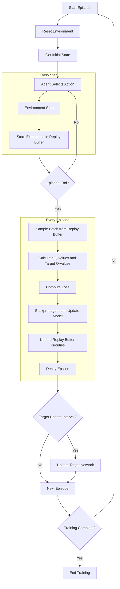
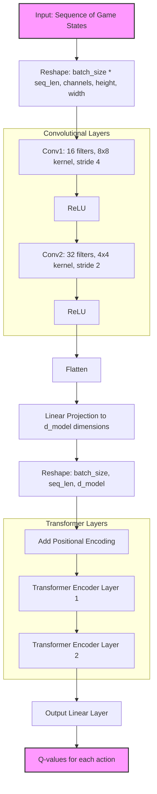

# PoliwhiRL README
<p align="left">
  <a href="https://results.pre-commit.ci/latest/github/AoifeHughes/PoliwhiRL/main">
    
  </a>
  <a href="https://github.com/AoifeHughes/PoliwhiRL/actions/workflows/run_tests.yml">
    
  </a>
</p>


## Legal Disclaimer
This project is not affiliated with, endorsed, or sponsored by Nintendo, Game Freak, or The Pokémon Company. All Pokémon games and characters are trademarks of Nintendo, Game Freak, and The Pokémon Company. This project is intended for educational and research purposes only.

All usage of The Pokemon Company International's games is done with the understanding that software is legally obtained and that the user has the right to use it. This project does not provide any ROMs or copyrighted materials.

## Overview
PoliwhiRL is a Reinforcement Learning library designed for sprite-based 2-D Pokémon games. It provides a framework for experimenting with different RL algorithms to interact with Pokémon games in an emulated environment. The current focus is on a Transformer-based DQN model.

## Configuration

The project uses a configuration system that allows for easy customization of various parameters. The default configuration is stored in `./configs/default_config.json`. Users can override these defaults by providing their own configuration file or using command-line arguments.

Here's an example of the default configuration:

```json
{
  "rom_path": "./emu_files/Pokemon - Crystal Version.gbc",
  "state_path": "./emu_files/states/start.state",
  "episode_length": 50,
  "device": "mps",
  "num_episodes": 500,
  "batch_size": 64,
  "checkpoint": "./Training Outputs/checkpoints/DQNLSTM.pth",
  "model": "DQN",
  "erase": true,
  "gamma": 0.99,
  "scaling_factor": 1,
  "extra_files": [
    "./emu_files/Pokemon - Crystal Version.gbc.ram",
    "./emu_files/Pokemon - Crystal Version.gbc.rtc"
  ],
  "location_goals": [
    [[9, 1, 6, 50]],
    [[8, 4, 6, 50], [9, 4, 6, 50]],
    [[8, 5, 6, 50], [9, 5, 6, 50]],
    [[13, 6, 4, 50]],
    [[6, 4, 4, 50]],
    [[59, 8, 3, 50], [59, 9, 3, 50]],
    [[31, 13, 3, 50]]
  ],
  "pokedex_goals": {
    "owned": 1,
    "seen": 2
  },
  "use_grayscale": false,
  "learning_rate": 1e-4,
  "vision": true,
  "N_goals_target": 1,
  "epochs": 4,
  "epsilon_start": 1.0,
  "epsilon_end": 0.01,
  "epsilon_decay": 0.99,
  "target_update_frequency": 50,
  "replay_buffer_capacity": 10000,
  "sequence_length": 4,
  "results_dir": "./Training Outputs/Results",
  "db_path": "./Training Outputs/Database/memory.db",
  "record_path": "./Training Outputs/Runs",
  "record": true,
  "break_on_goal": true
}
```

## Command-Line Usage

The main script `main.py` supports several modes of operation:

1. DQN Training: `python main.py --model DQN`
2. Memory Exploration: `python main.py --model explore`
3. Reward System Evaluation: `python main.py --model evaluate`

You can override any configuration parameter using command-line arguments. For example:

```
python main.py --model DQN --device cuda --num_episodes 1000
```

## Models

### DQN (Current Focus)

The current implementation uses a Transformer-based DQN model. This model is designed to capture long-term dependencies in the game state, which is crucial for playing Pokémon effectively. The model processes sequences of game states and uses self-attention mechanisms to identify important patterns over time.

Key features of the DQN model:
- Transformer architecture for processing sequential data
- Convolutional layers for processing visual input
- Prioritized Experience Replay for efficient learning
- Double DQN technique to reduce overestimation bias

## Memory2Image

The project includes a `Memory2Image` folder containing models to convert RAM data to images when trained. This can be useful for visualizing the internal state of the game and potentially improving the model's understanding of the game state.

## Reward System

The reward system is crucial for guiding the agent's learning process. More detailed documentation about the rewards system can be found in the "Rewards Documents" folder.

The current reward system includes:
- Goal-based rewards for reaching specific locations
- Exploration rewards for visiting new tiles
- Pokédex-based rewards for seeing and catching new Pokémon
- Step penalties to encourage efficiency
- Episode termination penalties

The reward calculation takes into account:
- Progress towards location-based goals
- Exploration of new areas (with a decay factor)
- Pokédex completion
- Efficient movement and action selection

## Requirements

The library dependencies are specified in `requirements.txt`, including PyTorch, NumPy, Matplotlib, and others necessary for running the models and processing the game environment.

## Future Work

- Extend support for other sprite-based 2-D Pokémon games
- Implement and compare performance with other RL algorithms
- Enhance the reward system based on more complex game objectives
- Improve the Memory2Image models for better state representation

For more details on the implementation and usage, refer to the [PoliwhiRL GitHub repository](https://github.com/AoifeHughes/PoliwhiRL)

## Paper

For more details on the implementation and the results, refer to the [PoliwhiRL
paper](./paper/paper.pdf).

## Training Flow

The following diagram illustrates the training flow and the key components of the DQN model:



## Model Architecture:



## License

This project is licensed under the MIT License. For more details, refer to the [LICENSE](./LICENSE) file.