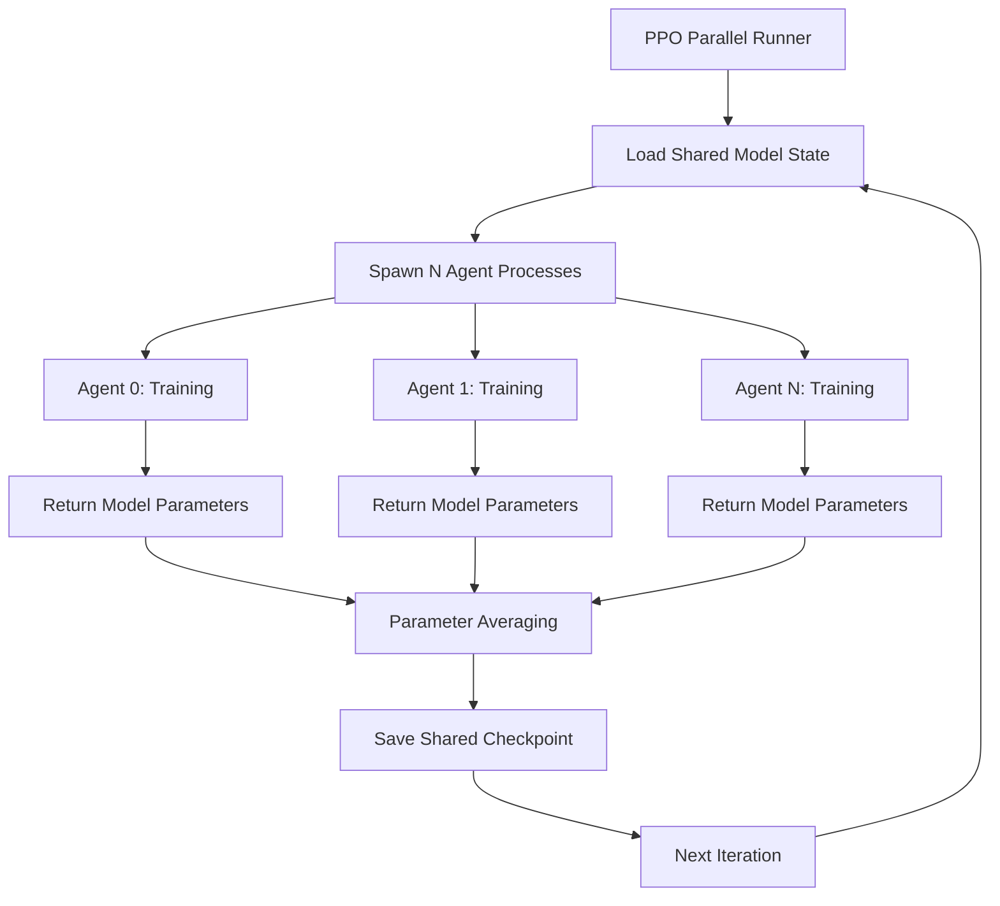
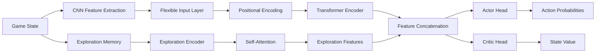

# PoliwhiRL README
<p align="left">
  <a href="https://results.pre-commit.ci/latest/github/AoifeHughes/PoliwhiRL/main">
    
  </a>
  <a href="https://github.com/AoifeHughes/PoliwhiRL/actions/workflows/run_tests.yml">
    
  </a>
</p>


## Legal Disclaimer
This project is not affiliated with, endorsed, or sponsored by Nintendo, Game Freak, or The Pokémon Company. All Pokémon games and characters are trademarks of Nintendo, Game Freak, and The Pokémon Company. This project is intended for educational and research purposes only.

All usage of The Pokemon Company International's games is done with the understanding that software is legally obtained and that the user has the right to use it. This project does not provide any ROMs or copyrighted materials.

## Overview
PoliwhiRL is a sophisticated Reinforcement Learning library designed for training AI agents to play sprite-based 2D Pokémon games. The system leverages PyBoy emulator integration and implements advanced RL techniques including **Transformer-based models**, **intrinsic curiosity**, **macro action learning**, and **multi-agent training**. The current focus is on PPO (Proximal Policy Optimization) with multi-agent parallel training.

## Key Features

- **Advanced Model Architectures**: Transformer-based PPO and DQN models with attention mechanisms
- **Multi-Agent Training**: Parallel agent execution with parameter averaging for improved stability
- **Curriculum Learning**: Progressive training system with increasing goal complexity
- **Intrinsic Curiosity Module (ICM)**: Curiosity-driven exploration for better learning
- **Macro Action Learning**: Automatic discovery of useful action sequences
- **Enhanced Exploration**: Sophisticated memory systems for efficient exploration
- **Goal-Oriented Rewards**: Complex reward system based on location goals and Pokédex completion

## Quick Start

### Basic Training
```bash
# Train with PPO (default, single agent)
python main.py

# Train with multi-agent PPO (20 agents in parallel)
python main.py --ppo_num_agents 20

# Train with DQN
python main.py --model DQN

# Memory exploration mode
python main.py --model explore

# Evaluate reward system
python main.py --model evaluate
```

### Curriculum Learning
For progressive training with increasing difficulty:
```bash
./run_curriculum.sh
```
This runs a 7-stage curriculum (1→7 goals) with increasingly tight step constraints.

## Models

### PPO (Primary Focus)

The current implementation uses a **Transformer-based PPO model** with several advanced features:

**Key Components:**
- **PPOTransformer**: Actor-critic network with self-attention mechanisms
- **Exploration Memory Integration**: Location visit history processed with attention
- **ICM Module**: Intrinsic motivation through curiosity-driven exploration
- **Macro Action Learning**: Automatic discovery of useful behavioral patterns

**Multi-Agent Training:**
- Parallel execution of multiple agents using `multiprocessing.Pool`
- Parameter averaging across agents for improved stability
- Individual agent checkpoints preserve training history
- Fault tolerance: continues if some agents fail

### DQN (Alternative)

Transformer-based DQN model with:
- Sequential state processing with positional encoding
- Convolutional feature extraction for visual input
- Multi-agent support with temperature-based exploration

## Configuration System

PoliwhiRL uses a modular JSON-based configuration system located in `configs/default_configs/`:

- `core_settings.json` - Basic model and environment parameters
- `ppo_settings.json` - PPO-specific hyperparameters
- `episode_settings.json` - Episode length, curriculum settings
- `reward_settings.json` - Goal definitions and reward weights
- `rom_settings.json` - ROM paths and game files
- `outputs_settings.json` - Output directories and checkpoints

### Key Configuration Options

| Category | Variable | Description |
|----------|----------|-------------|
| **Core** | model | Model type: "PPO", "DQN", "explore", "evaluate" |
| | device | Device: "cpu", "cuda", "mps" |
| | vision | Use visual input vs. RAM-based features |
| **PPO** | ppo_num_agents | Number of parallel agents (1 for single-agent) |
| | ppo_iterations | Number of training iterations |
| | ppo_learning_rate | Learning rate for PPO algorithm |
| | ppo_epochs | Epochs per update |
| **Episodes** | episode_length | Maximum steps per episode |
| | num_episodes | Episodes per agent per iteration |
| | use_curriculum | Enable curriculum learning |
| **Rewards** | N_goals_target | Number of location goals to target |
| | break_on_goal | End episode when goal reached |
| | punish_steps | Apply step penalties for efficiency |

### Command-Line Overrides

Any configuration parameter can be overridden via command line:

```bash
python main.py --model PPO --device cuda --ppo_num_agents 10 --num_episodes 50
```

## Advanced Features

### Curriculum Learning

The `run_curriculum.sh` script implements progressive training:

1. **Stage Progression**: 1 → 7 location goals
2. **Step Constraints**: 100 → 700 maximum steps (with aggressive minimization)
3. **Model Transfer**: Each stage loads the previous stage's checkpoint
4. **Optimization Pass**: Optional refinement with 20% tighter step limits

### Macro Action Learning

Automatically discovers useful action sequences:
- Tracks action patterns during episodes
- Evaluates sequences based on success rate and average reward
- Creates macro actions for successful patterns (≥70% success, avg reward >0.2)
- Integrates discovered macros into the action space

### Exploration Systems

**Enhanced Exploration Memory:**
- State transition mapping and waypoint discovery
- Exploration bonuses for visiting new areas
- Action effectiveness tracking
- Sequence pattern recognition

**Standard Exploration Memory:**
- Visit frequency and recency tracking
- Exploration tensor input to models

### Intrinsic Curiosity Module (ICM)

Provides curiosity-driven exploration through:
- **Forward Model**: Predicts next state features given current state and action
- **Inverse Model**: Predicts action given current and next state
- **Intrinsic Rewards**: Based on prediction errors (curiosity)

## Reward System

Complex goal-oriented reward structure:

- **Location Goals**: Sequential coordinate targets (1.0-5.0 points, decreasing with time)
- **Efficiency Bonuses**: 1.5x multiplier for quick goal completion (<50% of max steps)
- **Distance Guidance**: Proportional rewards for approaching current goal
- **Step Penalties**: Exponentially increasing negative rewards (-0.5 base)
- **Pokédex Progress**: Bonuses for discovering new Pokémon species

For detailed reward documentation, see `Reward Documentation/rewards.md`.

## File Structure

```
PoliwhiRL/
├── main.py                    # Entry point
├── run_curriculum.sh          # Curriculum learning script
├── configs/                   # Configuration files
├── PoliwhiRL/
│   ├── agents/               # RL Agent implementations
│   │   ├── PPO/
│   │   │   ├── ppo_agent.py         # Core PPO agent
│   │   │   └── parallel_runner.py   # Multi-agent coordinator
│   │   └── DQN/             # DQN implementations
│   ├── models/              # Neural network architectures
│   │   ├── PPO/PPOTransformer.py    # Transformer actor-critic
│   │   ├── DQN/DQNTransformer.py    # Transformer Q-network
│   │   └── ICM/icm.py               # Intrinsic Curiosity Module
│   ├── environment/         # Game environment interface
│   ├── utils/              # Utilities (macro actions, resource management)
│   └── replay/             # Memory and exploration systems
├── Memory2Image/           # RAM-to-image conversion tools
└── tests/                  # Test suite
```

## Requirements

Install dependencies:
```bash
pip install -r requirements.txt
```

Key dependencies include:
- PyTorch (with GPU support recommended)
- PyBoy (Game Boy emulator)
- NumPy, Matplotlib
- tqdm, wandb (optional)

## Testing

Run the test suite:
```bash
# All tests
pytest

# Specific test files
pytest tests/test_PPO.py
pytest tests/test_DQN.py

# With coverage
pytest --cov=PoliwhiRL
```

## Multi-Agent Training Flow


```mermaid
graph TD
    A[PPO Parallel Runner] --> B[Load Shared Model State]
    B --> C[Spawn N Agent Processes]
    C --> D[Agent 0: Training]
    C --> E[Agent 1: Training]
    C --> F[Agent N: Training]
    
    D --> G[Return Model Parameters]
    E --> H[Return Model Parameters]
    F --> I[Return Model Parameters]
    
    G --> J[Parameter Averaging]
    H --> J
    I --> J
    
    J --> K[Save Shared Checkpoint]
    K --> L[Next Iteration]
    L --> B
```

## PPO Model Architecture


```mermaid
graph LR
    A[Game State] --> B[CNN Feature Extraction]
    A --> C[Exploration Memory]
    
    B --> D[Flexible Input Layer]
    C --> E[Exploration Encoder]
    
    D --> F[Positional Encoding]
    E --> G[Self-Attention]
    
    F --> H[Transformer Encoder]
    G --> I[Exploration Features]
    
    H --> J[Feature Concatenation]
    I --> J
    
    J --> K[Actor Head]
    J --> L[Critic Head]
    
    K --> M[Action Probabilities]
    L --> N[State Value]
```

## Documentation

- **[ARCHITECTURE.md](./ARCHITECTURE.md)** - Detailed technical documentation with diagrams
- **[Reward Documentation/](./Reward%20Documentation/)** - Reward system details
- **[paper/paper.pdf](./paper/paper.pdf)** - Research paper with results

## Future Work

- **Algorithm Extensions**: Implement other advanced RL algorithms (SAC, A3C)
- **Game Support**: Extend to other sprite-based Pokémon games
- **Model Improvements**: Enhanced transformer architectures, better exploration
- **Evaluation**: More comprehensive benchmarking and analysis tools

## Contributing

1. Fork the repository
2. Create a feature branch
3. Make changes with appropriate tests
4. Run pre-commit hooks: `pre-commit run --all-files`
5. Submit a pull request

## License

This project is licensed under the MIT License. See [LICENSE](./LICENSE) for details.

For more details on the implementation and usage, refer to the [PoliwhiRL GitHub repository](https://github.com/AoifeHughes/PoliwhiRL).